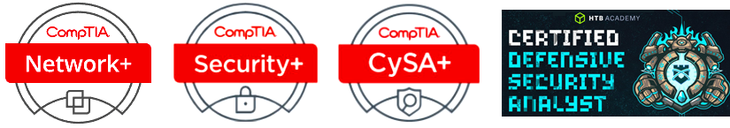

<h2>Hi, I'm Chuanyi Yang, a Cybersecurity Analyst and IT Professional.👨‍💻</h2>

<h3>I am actively seeking an entry-level position in cybersecurity, such as Cybersecurity Analyst, SOC Analyst, or Cyber Incident Responder, where I can apply my cybersecurity knowledge and skills.</h3>

<h3>I hold a B.S. degree in Cybersecurity and several related certifications. Over the years, I have gained extensive and in-depth hands-on lab experience through various online platforms and my own home labs, practicing and developing my skills with industry-standard tools and techniques for security analysis, SOC operations, and incident handling. </h3>

<h3>I am certified by:</h3>

<h4>Hands-on lab experiences are crucial for cybersecurity professionals as they bridge the gap between theoretical knowledge and real-world application. I continually develop and enhance my skills through various online platforms and personal home labs. I have completed over 100 lab experiences so far. </h4>
  
<h4>Below are some projects and lab experiences I have completed or am currently working on. These labs provide me with opportunities to work directly with tools, techniques, and scenarios commonly encountered in the field:</h4>

<h4>• <u><a href="https://github.com/cyyang75/aci-practice-labs" target="_blank">ACI Learning Practice Labs</a></u> (16 labs on Computer Networking, Network Security, and System and Communication Security)</h4>

<h4>• <u><a href="https://github.com/cyyang75/infosec-learning-labs" target="_blank">InfoSec Learning Labs</a></u> (30 labs on Operating System Security, Application Security and Network Defense)</h4>

<h4>• <u><a href="https://github.com/cyyang75/comptia-certmaster-labs-for-security" target="_blank">CompTIA CertMaster Labs for Security+ (Exam SY0-701)</a></u>: 37 labs</h4>

<h4>• <u><a href="https://github.com/cyyang75/comptia-certmaster-labs-for-cysa" target="_blank">CompTIA CertMaster Labs for CySA+ (Exam CS0-003)</a></u>: 33 labs</h4>

<h4>• <u><a href="https://github.com/cyyang75/hackthebox-cdsa" target="_blank">Hack The Box (HTB) SOC Analyst Path Labs</a></u> (15 modules)</h4>

<h4>• <u><a href="https://github.com/cyyang75/hacksplaining-web-application-security" target="_blank">Hacksplaining Web Application Security</a> (39 lessons) </u></h4>

<h4>• <u><a href="https://github.com/cyyang75/metasploit-free-online-ethical-hacking-course" target="_blank">Metasploit Free Online Ethical Hacking Course</a></u></h4>

<h4>• <u><a href="https://github.com/cyyang75/my-homelabs" target="_blank">My Cybersecurity Homelabs</a></u></h4>

<h4>As I continue studying and working in the field of cybersecurity, my list of lab experiences will keep growing, along with my skills and expertise.</h4>

<h2>🤳Connect with me:</h2>

